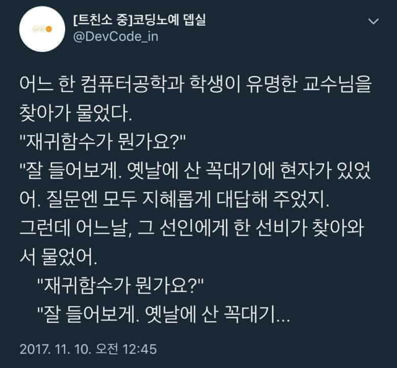

# 함수
함수는 하나의 특별한 목적의 작업을 독립적으로 수행하기 위해 설계된 코드의 집합이다.

## 함수를 사용하는 이유
함수를 사용하는 가장 큰 이유는 **같은 기능을 하는 코드의 중복성 최소화**를 하게 위해서이다. 또한 코드를 따로 분리 하는 것이기에 **가독성**이 좋아지며 기능 변경이 필요할 시 손쉽게 **유지보수**가 된다.

## 함수 정의 법
```C
// 반환타입 함수명(파라미터) 
//    {
//      함수 내 처리 코드
//    }
#include <stdio.h>

int calcPlus(int a, int b)
{
    return a + b;
}

int main(void) 
{
    int num = calcPlus(5,8);
    printf("%d",num);
    return 0;
}

```
추가로 만약 main 함수가 먼저 컴파일을 시킬 때 사용하는 **함수의 원형 선언**이다. C언어에서는 코드의 순서대로 컴파일하는데 여기서 main 함수 안에서 사용된 함수는 컴파일러는 모르기에 컴파일러에게 **이런 함수가 있어~** 라고 알려줘야만 한다. 그 역할이 바로 함수의 원형 선언이다.

```C

#include <stdio.h>

int CalcPlus(int, int);

int main(void) 
{
    int num = CalcPlus(5,8);
    printf("%d",num);
    return 0;
}

int CalcPlus(int a, int b)
{
    return a + b;
}
```

``int CalcPlus(int, int);``
이 형태가 바로 함수의 원형 선언이다.

## Static 변수
Static 변수는 지역변수의 특징과 전역변수의 특징을 동시에 가지고 있는 변수다.

### Static 변수의 특징
1. 해당된 블럭스코프 안에서만 접근이 가능하다. (지역변수 특징)
2. 딱 1회가 초기화되고 프로그램 종료 시까지 메모리 공간에 존재한다. (전역변수 특징)

## 재귀함수
재귀함수란 함수내에서 자기 자신을 계속 불러오는 함수를 뜻한다.

